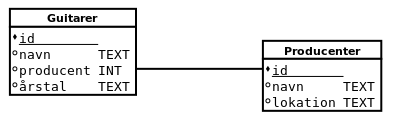
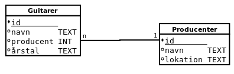

.. _sec-er-diagrammer:

===========================
Dokumentation til databaser
===========================

ER diagrammer
-------------

I rigtige systemer kan antallet af databasetabeller let blive meget højt. Tænk på brugerprofiler, opslag, billeder, tags, events osv., og på alle de relationer, der kan være mellem dem. For at kunne overskue hele databasen, kan man bruge en dokumentationsform der hedder et *ER diagram*. I denne artikel kan du læse om ER diagrammer og se eksempler på dem.

Entity-Relationship diagram
---------------------------
Formålet med ER diagrammet er, at vise de objekter (entities) som databasen består af, og relationerne mellem dem. På diagrammet herunder kan du se to tabeller, som du kender fra de tidligere artikler: Guitarer og Producenter.

  ER-diagram med to tabeller og en relation mellem dem.

  ..

På figuren kan man se hvordan tabellen med guitarer er relateret til tabellen med producenter, via producentens id. Desuden vises navn og datatype for hver kolonne, under hver tabel. Vha. diagrammet kan man danne sig et overblik over databasens *struktur*, uden at bekymre sig om hvilken data, der ligger i databasen. (ER-diagrammet kaldes et *strukturdiagram*, ligesom klassediagrammet, som du måske kender fra objektorienteret programmering.)

Multiplicitet
-------------
Multipliciteten i relationen mellem to tabeller er et vigtigt koncept når man designer databaser. I artiklen om avancerede koncepter kan du læse om en-til-mange relationer og mange-til-mange relationer. Multipliciteten kan også angives på et ER-diagram, ved at skrive et tal i hver ende af den streg, der forbinder tabellerne. Når antallet er ukendt - eller kan være vilkårligt stort - bruges *n*.

  Her er relationen mellem tabellerne markeret med multipliciteten: Én producent kan lave flere guitarer.

  ..

På figuren herover er der tale om en en-til-mange relation. Hvis man i stedet vil vise en mange-til-mange relation, ser det ud som herunder, mellem guitarer og guitarister:

  .. figure:: figs/er-diagram3.png
    :alt: Mange-til-mange relation

    Det komplette ER-diagram for guitar-databasen.

    ..
