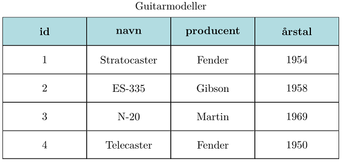
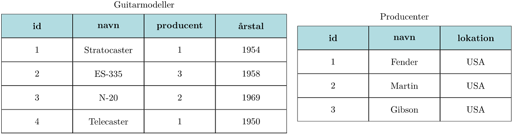
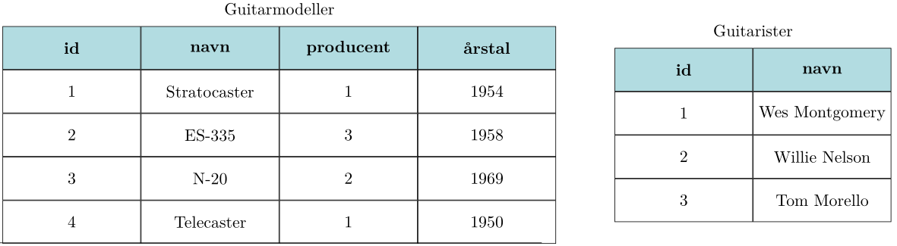
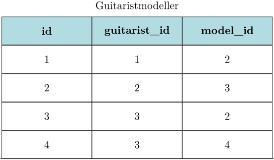
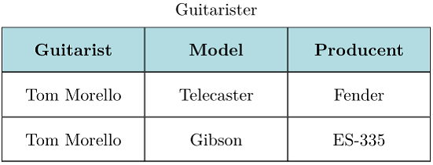

.. _sec-sql-advanced:

==========================
Avancerede koncepter i SQL
==========================
.. sidebar:: SQL og databaser

  Denne side bygger videre på den generelle artikel om databaser, som du kan se `her`_.

.. _her: sqlite.html

I denne artikel tager vi hul på nogle lidt mere avancerede koncepter indenfor databaseprogrammering. Det kommer først til at handle om forskellige måder at designe tabeller på, og senere om hvordan data fra forskellige tabeller kan kombineres med SQL.

Databasedesign
--------------

.. highlight:: sql

Databasen er en central del af mange store IT-systemer, og måden man har designet databasen kan være helt afgørende for hvor godt systemet fungerer, og hvilke muligheder man har for at udvide systemet. Her er et par eksempler:

- Facebook: Alle brugere har selvfølgelig en profil, men hvordan kan man gemme listen af ens venner i en database? Hvad med alle de billeder man uploader, og information om hvem der må se billederne? Når millioner af mennesker samtidig skal kunne navigere rundt på facebook og se korrekte oplysninger på ganske få milisekunder, så skal databasen være lavet på den helt rigtige måde.

- ebay: Forestil dig et meget populært objekt, der er til salg på ebay. Folk fra hele verden skal kunne byde på objektet. De skal hele tiden kunne se det højeste bud, og være sikre på at kunne byde lige indtil deadline.

- Skolens IT-system: Elever, klasser, fag, eksamen, lærere, lokaler... Alle de ting skal kunne kombineres på mange forskellige måder. Databasen skal understøtte at der nemt kan oprettes nye hold, elever skal meldes ind og ud, karakterer skal registreres, hold kan skifte lærer, osv... Når man ønsker at udvide sådan et system med nye funktioner, så kan man nemt komme ud for at det bliver svært, hvis ikke databasen er designet hensigtsmæssigt.

En-til-mange relation
---------------------

Tidligere har vi kigget på en databasetabel som den på Figur 1.

  Figur 1: En databasetabel om forskellige guitarmodeller.

  ..

Lad os se på den kolonne der hedder producent. Her kan vi se at den samme producent går igen hos flere guitarmodeller. Det kalder man for en **én-til-mange relation** (En producent har mange guitarmodeller). I det tilfælde vil man ofte dele databasen op i to tabeller, som vist på figur 2. I den første tabel er kolonnen med producenten skiftet ud med et id, som peger på en række i den nye tabel, som indeholder informationer om producenterne. Kolonnen med henvisning til producenten kaldes for en **foreign key**, fordi den henviser til et id i en anden tabel.

  Figur 2: En-til-mange relation.

  ..

Denne konstruktion tilføjer en masse nye muligheder til databasen.

* Nu kan producenterne optræde som selvstændige objekter i systemet. Man kan tilføje, slette og rette i oplysningerne om producenterne, uafhængigt af guitarmodellerne.
* Hvis man skal rette et navn, skal man kun rette i den anden tabel, og så vil det nye navn automatisk være associeret med alle de modeller, der bruger det tilsvarende producent-id.

Mange-til-mange relation
------------------------

Det næste skridt er et system, hvor der skal være . Du kan for eksempel tænke på et socialt medie hvor alle brugerne skal kunne følge hinanden, være venner, være med i de samme grupper, osv.

Lad os udvide vores guitareksempel med en ny tabel: Guitarister.

  Figur 3: Guitarer og guitarister.

  ..

Nu ønsker vi at kunne registrere hvilke guitarmodeller de forskellige guitarister spiller på. Her guitarist kan spille på flere forskellige modeller, og hver model kan bruges af flere forskellige guitarister. Der er altså tale om en **mange-til-mange relation** mellem guitarmodeller og guitarister.

Den første tanke kunne være, at inkludere oplysningerne om guitaristerne i tabellen med guitarmodeller. Men hvor mange kolonner skulle man afsætte til det? Det ville meget hurtigt blive svært at vedligeholde og udbygge.

Løsningen er i stedet at lave en tredje tabel, der skaber referencer mellem guitaristerne og guitarmodellerne. Den kan ses på figur 4:

  Figur 4: Associationer mellem guitarmodeller og guitarister.

  ..

De to sidste kolonner i denne nye tabel peger på enten en guitarist eller en guitarmodel, og indeholder både guitarmodeller med flere guitarister, og flere guitarmodeller til den samme guitarist. Man kan altså nemt finde både alle de guitarister der spiller på en bestemt guitar, og alle de guitarer, som en bestemt guitarist spiller på.

I næste afsnit skal vi se på hvordan man kan skrive den SQL-kode der skal til, når man har lavet denne slags associationer i sin database.

Avanceret SQL
-------------

En-til-mange
^^^^^^^^^^^^

Vi starter med en-til-mange associationen, som vist på Figur 2. Selvom navnet på producenten nu eksisterer i en anden tabel, ønsker vi stadig at kunne få databasen til at give os en tabel som den der er vist på Figur 1, selvom den faktisk ikke længere eksisterer som en "rigtig" tabel i databasen.

Idéen er at kombinere kolonner fra forskellige tabeller, og det gør man vha. det man kalder **JOIN** i SQL. Her er et eksempel::

  SELECT guitarmodeller.navn, producenter.navn, guitarmodeller.aarstal, producenter.lokation
  FROM guitarmodeller
  INNER JOIN producenter
  ON guitarmodeller.producent = producenter.id;

Læg mærke til at:
  - De kolonner man ønsker i tabellen står efter SELECT, på formen <tabel>.<kolonnenavn>. Det fortæller databasen hvilke tabeller der skal læses og medtages i den nye tabel.
  - **INNER JOIN** bruges når de to tabeller der skal kombineres har et overlap. Der findes og andre typer af JOIN-klausuler, som du f.eks. kan læse om på `wikipedia`_.

.. _wikipedia: https://en.wikipedia.org/wiki/Join_(SQL)

  - ON-klausulen fortæller hvilke rækker der skal med i vores tabel. Når vi kræver at **guitarmodeller.producent = producenter.id**, så sikrer vi os at vi kun får de guitarmodeller, hvor der findes en producent.

Kortere SQL
"""""""""""

Når de her SQL-statements bliver længere, kan de også være lidt svære at læse og afkode, så derfor kan man korte lidt ned på koden, ved at give tabellerne nogle lidt kortere navne::

  SELECT gm.navn, p.navn, gm.aarstal, p.lokation
  FROM guitarmodeller gm
  INNER JOIN producenter p
  ON gm.producent = p.id;

Mange-til-mange
^^^^^^^^^^^^^^^

I dette sidste eksempel skal vi se på hvordan man kan samle data fra flere end to tabeller. Det er nødvendigt når man har lavet en mange-til-mange relation, som vi gjorde på Figur 3 og 4.

Vi har nu tre tabeller i spil, og en fjerde tabel der samler oplysningerne. Vi vil samle en tabel som den på Figur 5 herunder.

  Figur 5: Her er der samlet kolonner fra tre forskellige tabeller, vha. indeks fra en fjerde tabel.

  ..

Ligesom i forrige eksempel skal vi bruge **JOIN**. For at bevare overblikket, bygger vi vores tabel op i lidt mindre skridt. (Det er nok en god idé, hvis du tager et stykke papir, og tegner de fire tabeller - guitarister, guitarmodeller, producenter og guitaristmodeller - ved siden af hinanden, så du kan overskue alle navnene.)

Først beslutter vi hvilke navne vi vil give til de fire tabeller, så vores SQL-kode ikke bliver for lang:

.. csv-table:: Tabelnavne
   :header: "Tabellens navn", "Navn i SQL"
   :widths: 30, 30

   "guitarmodeller", "m"
   "producenter", "p"
   "guitarister", "g"
   "guitaristmodeller", "gm"

For at hente de tre kolonner fra Figur 5, skal vi altså starte vores **SELECT**-statement med::

  --Ufærdig SQL
  SELECT g.navn, m.navn, p.navn

Resten af vores **JOIN**-statement kan samles på flere forskellige måder, men vi starter bare med Guitaristmodeller (gm), fordi det er den, der indeholder vores mange-til-mange relation::

  --Ufærdig SQL
  SELECT g.navn, m.navn, p.navn FROM guitaristmodeller gm

Læg mærke til, at vi starter med gm, selvom vi faktisk ikke skal bruge nogle kolonner fra denne tabel, i vores færdige tabel! Vi samler guitaristernes navne::

  --Ufærdig SQL
  SELECT g.navn, m.navn, p.navn FROM guitaristmodeller gm
  INNER JOIN guitarister g ON gm.guitarist_id = g.id

**ON**-klausulen sørger for, at en guitarist bliver kombineret med de rækker fra guitaristmodeller, hvor id'et passer.

...og så kan vi sådan set bare fortsætte med guitarmodeller::

  --Ufærdig SQL
  SELECT g.navn, m.navn, p.navn FROM guitaristmodeller gm
  INNER JOIN guitarister g ON gm.guitarist_id = g.id
  INNER JOIN guitarmodeller m ON gm.model_id = m.id

...og endelig producenterne::

  SELECT g.navn, m.navn, p.navn FROM guitaristmodeller gm
  INNER JOIN guitarister g ON gm.guitarist_id = g.id
  INNER JOIN guitarmodeller m ON gm.model_id = m.id
  INNER JOIN producenter p ON m.producent = p.id;

...og for at vælge en bestemt guitarist, kan vi filtrere resultattabellen med en **WHERE**-klausul::

  SELECT g.navn, m.navn, p.navn FROM guitaristmodeller gm
  INNER JOIN guitarister g ON gm.guitarist_id = g.id
  INNER JOIN guitarmodeller m ON gm.model_id = m.id
  INNER JOIN producenter p ON m.producent = p.id
  WHERE g.id = 3;

Denne sidste SQL-instruktion giver os præcis den tabel, der er vist på Figur 5.
