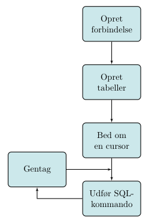

.. _sec-sqlite-python:

===============================
Databaser med SQLite i python
===============================
.. sidebar:: sqlite i python

  Denne side bygger videre på den generelle artikel om databaser, som du kan se `her`_.

.. _her: sqlite.html

Den nemmeste måde at komme igang med at bruge databaser i et python-program er, at bruge den lille simple database sqlite, der er indbygget i pythons standardbibliotek.

.. highlight:: python

I starten af dit program kan du importere biblioteket sqlite3, og så er du klar til at bruge en database::

  import sqlite3

Arbejdsgangen
-------------

Når man skal bruge en database i et program, er arbejdsgangen typisk noget, der minder om det du kan se på figuren herunder:

(Der skal selvfølgelig kun oprettes tabeller første gang databasen bruges.)

En **cursor** er programmets vej til at udføre SQL-kommandoer i databasen.

Oprettelse af forbindelse
^^^^^^^^^^^^^^^^^^^^^^^^^

Når man har importeret sqlite3-biblioteket skal man oprette forbindelse til databasen. Databaser kan findes mange steder, blandt andet på servere, så man skal oprette forbindelse via internettet eller et lokalt netværk, men med sqlite findes databasen som en fil på computeren::

  con = sqlite3.connect('guitarer.db')
  print('Database åbnet')

.. _sql: sqlite.html

(Eksemplerne her bygger videre på de tabeller, der blev oprettet i artiklerne om `sql`.)

Objektet *con* er vores forbindelse til databasen, og gennem den kan vi oprette tabeller, hvis det er nødvendigt::

  try:
      con.execute("""CREATE TABLE guitarmodeller (
  		id INTEGER PRIMARY KEY,
  		navn TEXT,
      producent INT,
      årstal INTEGER);""")
  except Exception as e:
      print('Tabellen findes allerede')

Kommandoen til at oprette tabellen er pakket ind i en **try-except** blok, fordi man vil få en exception hvis tabellen allerede findes. Man kan også bede om at få slettet en tabel::

  try:
      con.execute("""DROP TABLE IF EXISTS guitarmodeller;""")
      print('Tabellen blev slettet')
  except Exception as e:
      print('Fejl ved sletning af tabel')

  con.commit()

Den sidste linje sørger for at færdiggøre ændringerne i databasen. Det skal udføres hver gang man har skrevet en ændring i databasen.

Det er også vores connection-objekt, der kan give os en cursor til at få fat i tabeldata fra databasen. Her hentes en ny cursor, og en **SELECT**-kommando udføres::

  c = con.cursor()

  c.execute("""SELECT * FROM guitarmodeller;""")

  for g in c:
    print(g)

Til sidst udskrives alle de rækker, der blev returneret fra databasen.

Opgaver
-------

.. admonition:: Opgave 1

  a. Hent programmet :download:`database_start.py <src/database_start.py>` og kør det på din computer.

    Når programmet starter op vil det oprette en database i filen start.db, og indholdet af databasen kan vises via et simpelt tekstinterface.

    Undersøg koden, og find de steder hvor der bruges en af SQL-kommandoerne:

      - CREATE TABLE

      - INSERT

      - SELECT

  b. Udvid programmet med en ny kommando, som du kan kalde **slet**. Kommandoen skal slette alle rækker i tabellen vha. nedenstående SQL-kommando::

      DELETE FROM personer

    Du kan også prøve at tilføje en **WHERE** - klausul til kommandoen, så brugeren kan vælge hvilken person der skal slettes.

  c. Prøv at udvide tabellen med endnu en kolonne, så programmet også kan registrere en persons nationalitet. (Slet filen start.db, for at oprette en ny tabel)

.. .. literalinclude:: figs/database_start.py
    :linenos:
    :language: python
    :lines: 1, 3-5

.. admonition:: Opgave 2

  a.
