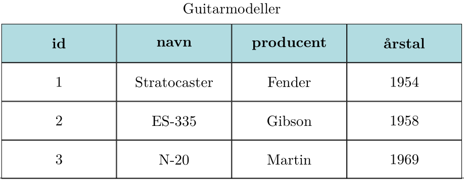
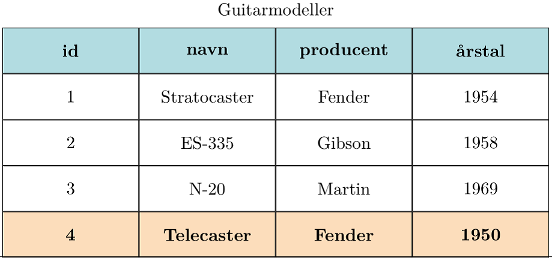
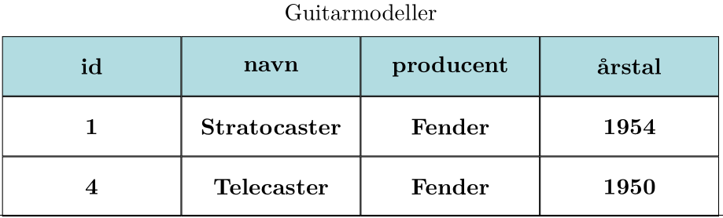
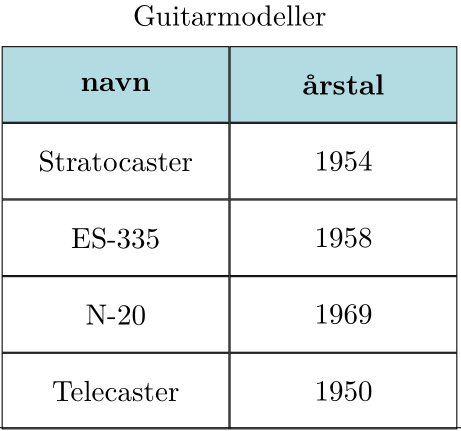

.. _sec-sql:

######################
Relationelle databaser
######################

De mest almindelige databaser er såkaldte *relationelle databaser*, og det betyder at de gemmer data lidt på samme måde som man ville have det stående i et regneark. Her kan du se et eksempel på noget data om guitarer.

  Figur 1: En databasetabel om forskellige guitarmodeller.

  ..

Sådan en mængde data kalder man en *tabel*, og en database kan bestå af en enkelt eller mange tabeller. Tabellen med guitarmodeller består af fire kolonner: id, navn, producent og årstal. I vores eksempel er der tre rækker; en til hver guitar.

For at kunne arbejde med databasen, skal programmet kunne udføre forskellige typer af kommandoer. De mest basale er **tilføjelse**, **læsning**, **opdatering** og **sletning**.

Tilføjelse af rækker
  Databasens tabeller skal kunne udvides med nye rækker.

..

  Figur 2: Der tilføjes en ny række til tabellen.

  ..

Læsning af rækker
  Man skal kunne udvælge en delmængde af rækkerne i en tabel, f.eks. alle guitarer fra producenten Fender.

..

  Figur 3: Alle guitarer fra Fender er udvalgt fra tabellen

  ..

Opdatering af rækker
  Man skal kunne ændre værdierne i de rækker der allerede er indtastet i tabellen.

Sletning af rækker
  Endelig skal man selvfølgelig kunne fjerne rækker fra en tabel.

Alle disse operationer kan udføres på alle databaser, og det mest almindelige er, at de skal udføres med et særlig sprog, der hedder **SQL**.

En sidste vigtig operation er at oprette nye tabeller i databasen. Dette gøres også med SQL, men det sker ofte som en seperat opgave inden databasen tages i brug.

SQL
---
.. sidebar:: SQL

   Her kan du læse en kort introduktion til det sprog, som man bruger til at arbejde med de fleste relationelle databaser. SQL er et omfattende sprog, som du kan læse meget mere om andre steder. Eksemplerne herunder dækker kun det allermest basale.

SQL står for 'Structured Query Language', og det er det sprog man i de fleste tilfælde bruger til at interagere med en database.

Oprettelse af tabellen (CREATE TABLE)
-------------------------------------

Inden en database kan tages i brug, skal man oprette de tabeller, som man har brug for i sit program. For at oprette en tabel skal man fortælle databasen hvad tabellens navn skal være, samt hvilke kolonner tabellen skal indeholde.

Eksemplet med guitarene fra Figur 1 kan oprettes med følgende SQL-kommando::

  CREATE TABLE guitarmodeller (id INTEGER PRIMARY KEY, navn TEXT, producent TEXT, årstal INTEGER);

Her er nogle ting, som er værd at bemærke om kommandoen:

  1. Alle ord der er skrevet med store bogstaver, hører til SQL-sproget. Alle ord der er skrevet med små bogstaver hører til vores tabel. Det er ikke noget krav at man skelner mellem store og små bogstaver på denne måde, men det er en meget udbredt praksis, som det er en god idé at følge.

  2. I parentesen, hvor de fire kolonner er defineret, skal man lægge mærke til at

    - Kolonnernes navne er de samme som på Figur 1.

    - Hver kolonne har en datatype. Der findes andre datatyper end dem der er nævnt her, og ikke alle datatyper findes i alle databaser.

    - Den første kolonne, id, er defineret som INTEGER PRIMARY KEY. Det er en særlig kolonne, som databasen bruger til at håndtere tabellens rækker. Det betyder f.eks. at der ikke kan være to guitarer med samme id.

  3. Den måde som tabellen er oprettet her er ikke den eneste mulighed, for eksempel kunne kolonnen med årstal sagtens have haft datatypen TEXT. I nogle tilfælde kan det være meget afgørende for hvor godt databasen fungerer, at man har valgt en hensigtsmæssig repræsentation.

Tilføj data (INSERT)
--------------------

En række kan tilføjes til en tabel ved kommandoen **INSERT**. Denne kommando svarer til den operation der er illustreret på Figur 2::

  INSERT INTO guitarmodeller (navn, producent, årstal) VALUES ('Telecaster', 'Fender', 1950);

Læg mærke til, at kolonnen med **id** ikke er specificeret. Det kan man undlade, fordi databasen selv sørger for at vedligeholde denne særlige kolonne. Hvis en af de normale kolonner udelades, bliver der blot et tomt felt i tabellen.

Man kan godt selv specificere et id til den nye række, mens hvis det id allerede eksisterer i tabellen, vil databasen afbryde med en fejl.

Læs data (SELECT)
-----------------

For at trække data ud fra databasen bruges SQL-kommandoen **SELECT**. For at vælge alle guitarer produceret af Fender, skal man bruge kommandoen::

  SELECT * FROM guitarmodeller WHERE producent = 'Fender';

SELECT er en meget fleksibel kommando, og måden man læser data fra en tabel er nærmest en hel videnskab i sig selv. Her nøjes vi med et par eksempler mere.

Her udvælges alle guitarmodeller fra 1950'erne::

  SELECT * FROM guitarmodeller WHERE årstal > 1949 AND årstal < 1960;

Den lille stjerne (**\***) efter SELECT angiver, at man ønsker at se alle kolonner fra tabellen. Det er tit hensigtsmæssigt kun at udvælge de kolonner man skal bruge. Det gøres ved::

  SELECT navn,årstal FROM guitarmodeller;

Dette giver et resultat som kun er en del af tabellen fra Figur 2.

  Figur 4: Her er der udvalgt to kolonner fra tabellen. Resultatet er i sig selv en tabel.

  ..

En nyttig funktion i databasen er, at man kan bede den sortere rækkerne inden resultatet returneres. Udover at det er praktisk at lade databasen gøre det, så er sortering også en operation som databaser er super optimerede til at gøre, og derfor foregår sorteringen næsten altid mere effektivt end man selv ville kunne gøre det::

  SELECT * FROM guitarmodeller ORDER BY årstal;

Ret data (UPDATE)
-----------------

Kommandoen til at ændre i en række hedder **UPDATE**. For at ændre i en række, skal databasen have at vide

  - Hvilken tabel man vil rette i.
  - Hvilke kolonner der skal rettes.
  - Hvilke værdier, der skal indsættes i kolonnerne.

I vores guitareksempel kunne en UPDATE-kommando se sådan her ud::

  UPDATE guitarmodeller SET årstal = 1968 WHERE id = 3;

Her sørger WHERE-klausulen for at udvælge de rækker, der skal rettes i. Alle de rækker der overholder kravet om **id = 3**, vil få rettet deres årstal. WHERE-klausulen godt kan udvælge flere rækker, for eksempel hvis man vil rette en fejl i teksten::

  UPDATE guitarmodeller SET producent = 'C. F. Martin' WHERE producent = 'Martin';

Slet data (DELETE)
------------------

Kommandoen DELETE bruges til at slette rækker fra en tabel. Igen bruges WHERE-klausulen til at udvælge de rækker, der skal slettes::

  DELETE FROM guitarmodeller WHERE id = 2;

Det kan være nyttigt at begrænse kommandoen til kun at slette en enkelt række::

  DELETE FROM guitarmodeller WHERE producent = 'Fender' LIMIT 1;

.. seealso::
    :ref:`sec-sqlite-python` og :ref:`sec-sql-advanced`.    
    
    
