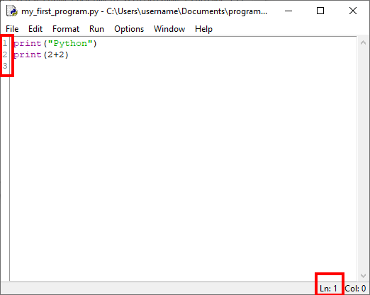

.. include:: ../global.rst

.. _sec-editor-idle:

#############
IDLE (editor) 
#############

.. _sec-editor-idle-linenumbers:

*********************
Visning af linjenumre
*********************
Som standard viser editoren ikke linjenumre
ned langs linjerne af den fil som redigeres.

Visning af linjenumre er et must
når man hurtigt skal finde linje 143 
som står angivet i en fejlmeddelelse.

Aktiver visning af linjenumre på følgende måde:

.. note:: 
    Dette kræver Python 3.8.0b3 (beta 3 af 3.8.0) eller
    muligvis version 3.7.5 når den udkommer.

    I tidligere udgaver af IDLE vises linjenummeret 
    kun for den linje cursoren står på
    som ``Ln: x`` i nederste højre hjørne af editoren.
     
Åbn IDLEs indstillinger ved at vælge menuen 
``[Options]`` > ``Configure IDLE`` (Windows og Linux)
eller med genvejen ``[⌘]``\ +\ ``,`` (macOS).

Vælg herefter fanebladet ``[General]``,
og sæt flueben ved valgmuligheden ``Show line numbers in new windows [ ]``,
tryk ``[Apply]`` og afslut med ``[Ok]``.

Indstillingen gælder kun for nye vinduer. 
Hvis du har en fil åben skal du lukke den og åbne den igen
for at få vist linjenumre.

Genvejen ``[ctrl]``\ +\ ``O`` (Windows og Linux)
eller ``[⌘]``\ +\ ``[O]`` (macOS)
åbner dialogen til åbning af fil (det er 'o' som i 'open').

Editorvinduet ser nu således ud, med linjenumre i venstre side.

 

