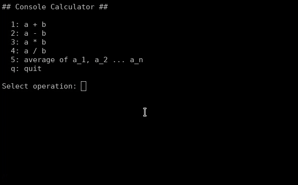

.. include:: ../../global.rst

.. _sec-informal-console-calculator:

###########################
Lommeregner (konsolbaseret)
###########################

I denne introduktion til programmering og Python 
udvikles en interaktiv konsolbaseret (tekstbaseret) lommeregner
som vist på :numref:`fig-console-calc-demo`.

.. _fig-console-calc-demo:

    Et konsolbaseret (tekstbaseret) lommeregnerprogram.

.. note::
    Introduktionerne antager du har gennemgået :ref:`sec-install`
    og :ref:`sec-first-program-first-error`.

Programmet du om lidt bliver hjulpet med at udvikle skal give brugeren
mulighed for at vælge i mellem forskellige regneoperationer
ved at taste et tal og trykke [Enter], 
f.eks. 1 for at udregne a+b.
Herefter skal brugeren kunne indtaste de tal eller størrelser
som udregningen kræver.
Til sidst skal programmet vise brugeren resultatet af regneoperationen
og give brugeren muligheden for at vælge en ny regneoperation.

**************************
Brugerinput og kommentarer
**************************
Opret et nyt program Python-program med et fornuftigt navn, 
f.eks. ``calculator.py``,
og gem det et fornuftigt sted,
f.eks. i en mappe kaldet ``programmering/introduktion/``.

Giv programmet følgende indhold:

.. admonition:: Anbefaling

    Skriv koden manuelt (tegn for tegn) ind i din teksteditor
    i stedet for at kopiere den og indsætte den (copy-and-paste).
    
    Hvis du skriver :numref:`prg-calc0` ind i din teksteditor
    så har du skrevet 5 linjers Python-kode.
    Hvis du kopiere og indsætter det har du skrevet 0 linjers Python-kode.

.. literalinclude:: programs/calc0.py
    :linenos:
    :caption: calculator.py 
    :name: prg-calc0

Kør programmet og når programmet beder dig indtaste et tal
skriver du blot et eller flere tal på tastaturet og trykker [Enter].
I din konsol bør du se noget som minder om nedenstående:

.. literalinclude:: programs/calc0.py.out
    :linenos:
    :language: text 
    :caption: output (calculator.py) 
    :name: output0

Meget muligt forstår du ikke hvorfor eksemplet
skriver ``1337`` som output (:numref:`output0`, linje 3).
Linje 6 (:numref:`prg-calc0`) havde måske ledt dig til at forvente output ``50``.
Den opførsel vender vi tilbage til.

Linje 1 (:numref:`prg-calc0`) som starter med tegnet ``#`` [#numbersign]_ er en kommentar.
Python ignorerer linjen,
men kommentarer er vigtige fordi de hjælper mennesker,
f.eks. dig selv i fremtiden,
med at forstå koden og programmets formål.

.. admonition:: Anbefaling

    Start alle programmet med en eller flere linjers kommentarer
    som beskriver hvad programmet gør
    og hvorfor du har skrevet det.

I linje 3 bruges *funktionen* ``input()`` til at bede brugeren om et tal (input). 
``"Write a number: "`` kaldes *argumentet* til funktionen ``input()``,
og vises på skærmen hvorefter programmet venter på brugeren skriver noget.
Programmet fortsætter når brugeren trykker [Enter].

Hvad end brugeren skriver gemmes i en *variabel* ``a``
således brugerens input kan bruges igen senere i programmet,
f.eks. i linje 5.

I linje 5 produceres en ny værdi baseret på brugerens input 
(gemt i variablene ``a`` og ``b``).
Den nye værdi produceres af *operatoren* ``+``
og gemmes i en ny variabel ``c``.
Variablene ``a`` og ``b`` i linje 5 kaldes også *operander* til operatoren ``+``.

Endlig skrives eller printes resultatet på skærmen i linje 6
vha. funktionen ``print()`` som kaldes med variablen ``c`` som argument.

***********************
13+37=1337? (datatyper)
***********************
Hvorfor giver programmet så output ``1337``
hvis brugeren skriver tallene 13 og 37 som input?

Det er fordi værdierne gemt i variabel ``a`` og ``b``
ikke er tal, men tekst
og hvis operatoren ``+`` får tekst som operander
så sætter den teksten sammen.
Hvis operatoren havde fået heltallene 13 og 37  som operander havde den, 
som forventet,
summeret tallene og produceret heltallet 50.

Hvordan konvertere man så teksten *13* og *37* til heltallene 13 og 37 
således ``+`` kan producere heltallet 50?
Det gøres med funktionen ``int()`` som konvertere sit argument
fra tekst til et heltal 
(*int* er en forkortelse for *integer*, engelsk for heltal).

Opret et nyt Python-program med et navn såsom ``test_data_types.py``
og giv det følgende indhold og kør programmet.

.. literalinclude:: programs/test_data_types.py
    :linenos:
    :caption: test_data_types.py
    :name: prg_test_data_types

.. literalinclude:: programs/test_data_types.py.out
    :language: text
    :linenos:
    :caption: output (test_data_types.py)
    :name: out_test_data_types

Outputtets linje 2 (:numref:`out_test_data_types`) 
er resultatet af programmets linje 9 (:numref:`prg_test_data_types`)
hvor ``+`` operatoren får ``"13"`` og ``"37"`` som operander
og resultatet bliver teksten 1337.

I programmets linje 6 og 7 bruges funktionen ``int()``
til at konvertere teksten indeholdet i variablene ``c`` og ``d``
til heltal (integers) og resultatet gemmes i variablene ``cc`` og ``dd``.
Outputtets linje 3 er resultatet af programmets linje 10
hvor ``+`` får operanderne ``cc`` og ``dd`` (som nu er heltal)
og resultatet bliver nu tallet 50 (selvfølgelig printet som teksten 50 på skærmen).

Outputtets linje 4 viser også 50, resultatet af ``cc+e`` (programlinje 11).
Variablen ``e`` er direkte tildelt heltalsværdien ``13``
(i modsætning til tekstværdien ``"13"``).

I Python og mange andre programmeringssprog repræsentere ``"13"`` teksten 13
og kaldes en *string* (engelsk) eller *tekststreng* (dansk)
hvorimod ``13`` repræsentere heltallet 13 (engelsk: integer).

Outputtets linje 5-8 viser en fejl ``TypeError: can only concatenate str (not "int") to str``.
Som fejlmeddelelsen angiver sker fejlen i programmets linje 12 
hvor variablene ``c`` og ``e`` gives som operander til ``+``.
Det virker ikke fordi de to variable indeholder værdier af forskellige typer
(str: tekst/string, int: heltal/integer).
Mens man måske kan retfærdiggøre resultatet af teksten ``"2"+2`` 
skulle være ``"4"`` eller ``4``,
er det svært at retfærdiggøre ``"horse" + 7`` ikke skal give en fejl.

Lad os bruge funktionen ``type()`` til at bekræfte datatypen af de variable
vi lige har omtalt. Modificer programmet således:

.. literalinclude:: programs/test_data_types1.py
    :linenos:
    :caption: test_data_types.py
    :name: prg_test_data_types1

.. literalinclude:: programs/test_data_types1.py.out
    :language: text
    :linenos:
    :caption: output (test_data_types.py)
    :name: out_test_data_types1

Linje 12 er nu det man kalder *udkommenteret*, 
``#`` som første tegn på linjen gør linjen ignoreres. 
Således resultere programmet ikke længere i en fejl.
Bemærk der også er tilføjet en ekstra kommentar
i slutningen af linjen som forklarer hvad
der er specielt ved denne linje.

Linjerne 14-17 af benytter funktionen ``type()``
til at bestemme, eller undersøge, datatypen af programmets variable.
Fra outputtets linje 5, som stammer fra programmets linje 14,
kan vi se at ``c`` er en string (*str* er en forkortelse for string),
og dermed er ``d`` også en string.
``e`` og ``cc`` er integers eller heltal (*int* er forkortelse for integer).

.. admonition:: Udfordring

    Gør outputtet fra testprogrammet mere læsevenligt 
    ved at give ``print()``-funktionen flere argumenter som vist her:

    .. code-block:: python
        :linenos:

        print("some descriptive text", some_variable)

.. admonition:: Udfordring

    Kommatal skrives i Python og mange andre programmeringssprog som ``2.5``  med decimal punktum, 
    hvilket vidner om engelsk talende landes rolle i udviklingen af computeren.
    Kommatals datatype kaldes *float* og strings kan konverteres til floats vha. funktionen ``float()``.    

    Lav samme test som vi lige har lavet med strings og integers,
    med floats i stedet. 

***************************************
Næste version af lommeregnerprogrammet
***************************************
Med vores nyfundne viden om datatyperne integers og strings (muligvis floats, se udfordringen ovenfor)
kan vi nu sørge for at lommeregnerprogrammet
bruger brugerens input som tal og ikke som tekst,
altså få programmet til at producere outputtet ``50``
når brugeren giver 13 og 37 som input.

.. admonition:: Udfordring

    Benyt det du lige har lært om datatyper til at
    sørge for lommeregnerprogrammet benytter brugerens input 
    som tal og producere ``50`` som output når brugeren 
    giver 13 og 37 som input.

En mulig ny version af programmet (og løsning på ovenstående udfordring)
kunne se ud på følgende måde, 
men der er mange andre løsninger som vil give præcist samme output:

.. literalinclude:: programs/calc2.py
    :linenos:
    :caption: calculator.py
    :name: prg_calc2

.. literalinclude:: programs/calc2.py.out
    :language: text
    :linenos:
    :caption: output (calculator.py)
    :name: out_calc2

I løsningen her er der oprettet to ny variable ``in1`` og ``in2``
(*in* for *input*)
til at gemme de rå brugerinput (strings)
og de to variable ``a`` og ``b`` bruges nu til at gemme de konverterede værdier (integers),
men man kunne også have skrevet ``a = int(input("Write a number: "))``
og undladt variablene ``in1`` og ``in2``.

Lad os forbedre brugervenligheden af programemt 
ved at sørge for programmet fortæller brugeren
hvad de to tal skal bruges til
og læsevenligheden af outputtet ved at tydeliggøre hvilken linje der er resultatet:

.. literalinclude:: programs/calc3.py
    :linenos:
    :caption: calculator.py
    :name: prg_calc3

.. literalinclude:: programs/calc3.py.out
    :language: text
    :linenos:
    :caption: output (calculator.py)
    :name: out_calc3

Det pæne output, f.eks. ``13+37=50`` dannes i programmets linje 8
vha. metoden ``str.format()``
som erstattet ``{}`` i en string med noget andet.
Første sæt ``{}`` i ``"{}+{}={}"`` erstattes med variablen ``a``,
næste sæt med ``b`` og sidste sæt med ``c``.
Resultatet af er en ny string som gemmes i variablen ``output``.

***************************
Tillad gentagne udregninger
***************************

Lommeregnerprogrammet, som demonstreret i starten,
giver brugeren mulighed for at lave
mere end én udregning uden at skulle genstarte programmet.
Vi har altså behov for at kunne gentage linje 2-9 (:numref:`prg_calc3`) 
flere gange (evt. uendeligt mange gange).
Det kan gøres med et såkaldt *while*-loop (eller while-løkke):

.. literalinclude:: programs/calc4.py
    :linenos:
    :caption: calculator.py
    :name: prg_calc4

Linje 3 ``while True:`` gentager de efterfølgende linjer 4-11
et uendeligt antal gange.
Linjerne 4-11 bliver gentaget fordi koden på disse linjer
er indrykket (engelsk: indented) i forhold til linje 3.

.. admonition:: Prøv

    Prøv at rykke forskellige linjers kode udenfor while-loopet.
    Enten ved at placere dem over linjen med ``while True:``
    eller ved ikke at rykke dem ind.

    Hvordan opfører programmet sig nu og hvorfor?

************************************
Tillad brugeren at stoppe programmet
************************************
Som programmet er nu kan programmet ikke stoppes af brugeren,
det bliver ved med at tilbyde udregning af a+b i det uendelige.

Et loop, f.eks. vores while-loop, kan stoppes vha. 
Python-udsagnet (engelsk: statement) ``break``. 
Hvis Python udfører en linje hvorpå der står ``break``
så stopper det loop Python er i færd med at udføre.
Lad os prøve at indsætte ``break`` et sted i vores loop:

.. literalinclude:: programs/calc5.py 
    :linenos:
    :emphasize-lines: 7
    :caption: calculator.py
    :name: prg_calc5

Nu stopper programmet selvfølgelig midt i en interaktion med brugeren,
det stopper efter at have spurgt om de to inputs.
Uanset hvor vi placere ``break`` (prøv evt. andre placeringer)
så vil programmet enten stoppe et uhensigtsmæssigt sted
eller stoppe efter en enkelt udregning.

Der er brug for en måde kun at udføre kommandoen ``break``
under nogle bestemte forudsætninger,
f.eks. hvis bruger skriver ``quit`` i stedet for et tal
når programmet spørger til tallene a og b.
En såkaldt if-sætning kan bruges til det formål:

.. literalinclude:: programs/calc6.py 
    :linenos:
    :emphasize-lines: 8,9
    :caption: calculator.py
    :name: prg_calc6

Linje 8 sammenligner indholdet i variablen ``in1`` med stringen ``"quit"``,
hvis de er ens så udføres linje 9 (``break``).
Således lukker programmet nu hvis brugeren skriver *quit* 
når programmet beder om en værdi for a 
(dog først efter brugeren også har angivet en værdi for b).

.. admonition:: Udfordring

    Omstruktruer koden således programmet lukker
    så snart brugeren har skrevet *quit* og trykket [Enter].

    Udvid programmet således programmet lukker uanset
    om brugeren angiver a eller b til *quit*.

.. admonition:: Udfordring

    Prøv at placere if-sætningen efter en af linjerne
    som konvertere ``in1`` og ``in2`` til integers.

    Hvad sker der nu?

**********************************
Arbejdsmetoden: Trinvis Forbedring
**********************************
Måske har du lagt mærke til, at vi indtil nu
har lavet mange forskellige udgaver af lommeregnerprogrammet
som gradvist kan mere og mere,
og som gradvist ligner eksemplet vist i starten mere og mere.
Det er en meget væsentlig pointe eller observation,
at programmer ikke skrives i deres fulde endelig version
uden at blive testet og omstruktureret under vejs.

Denne process eller arbejdsmetode hedder 
*trinvis forbedring* (engelsk: stepwise improvement) ...

.. rubric:: Fodnoter

.. [#numbersign] Tegnet ``#`` hedder ikke et `hashtag <https://en.wikipedia.org/wiki/Hashtag>`_.
    På engelsk hedder det *hash*, *number sign* eller *pound sign*,
    på dansk hedder det `havelåge <https://ordnet.dk/ddo/ordbog?entry_id=11020057&def_id=21031011&query=havel%C3%A5ge>`_.
    eller `dobbeltkryds <https://ordnet.dk/ddo/ordbog?entry_id=11009375&query=havel%C3%A5ge>`_.
 

