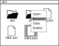
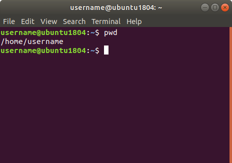
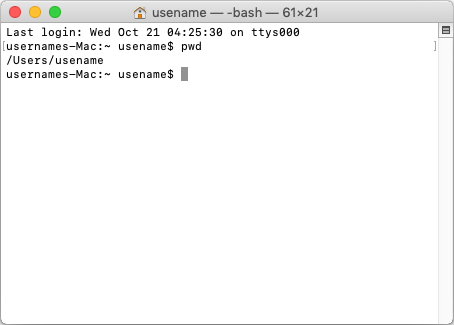
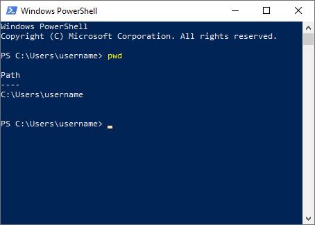

.. _sec-cli:

############################
Command line interface (CLI)
############################

Alle operativsystemer giver deres brugere mulighed for
at udføre handlinger ved at skrive kommandoer 
i stedet for via den grafiske brugergrænseflade (GUI).

De fleste har prøvet at omdøbe en fil
ved at højreklikke på filens ikon,
vælge et menupunkt [Rename] eller [Omdøb],
indtaste et nyt navn
og afslutte ved at trykke [Enter] eller klikke et andet sted på skærmen.

På mange operativsystemer det samme gøres med kommandoen 
``mv old_file_name new_file_name``.

Sådanne kommandoer indtastes i det der til dagligt kaldes
en kommandolinje eller terminal.
På Linux, macOS og Windows ser den indbyggede kommandolinje eller terminal
lidt forskellige ud,
men de giver alle brugeren mulighed for at betjene operativsystemet
med kommandoer.

*****
Linux
*****

De fleste linuxbrugere ved hvordan man åbner en terminal,
i moderne udgaver af Ubuntu kan man bruge genvejen [ctrl]+[alt]+[t].

    Ubuntu Gnome Terminal (bash shell)

*****
macOS
*****
I macOS kan du åbne applikationen Terminal
ved f.eks. at trykke [cmd]+[space], skrive *terminal* og trykke [Enter].

    macOS Terminal (bash shell)

*******
Windows
*******

I Windows kan du åbne applikationen Windows Powershell
ved f.eks. at trykk [win]+[r], skrive *powershell* og trykke [Enter].

    Windows Powershell 

**********
Kommandoer
**********

.. list-table:: 
    :header-rows: 1

    * - Beskrivelse/handling
      - Kommando
      - Eksempel

    * - Vis filer i mappe
      - ``ls``
      - 

    * - Vis nuværende mappe (working directory)
      - ``pwd``
      - 

    * - Skift mappe (working directory)
      - ``cd <directory>``
      - ``cd projects`` 

        ``cd "never use spaces"``

        ``cd never\ use\ spaces``

        ``cd projects/what_ever`` 

    * - Skift til forrige mappe (working directory)
      - ``cd ..``
      - 

    * - Opret mappe
      - ``mkdir <name>``
      - ``mkdir my-project``

**************
Tips og tricks
**************

* [Pil op] (piletasten) bladrer baglæns igennem tidligere udførte kommandoer.
  Brug den til at spare tastearbejde.

* [tab] bruges til at autocomplete kommandoer og filnavne,
  f.eks. ``cd pro[tab]`` vil autocomplete til ``cd projects/``
  hvis der er en mappe som hedder projects.

* [ctrl]+[r] lader dig søge i tidligere udførte kommandoer,
  f.eks. ``[ctrl]+[r] cd`` vil vise dig tidligere ``cd``-kommandoer
  du har udført (tryk [ctrl]+[r] gentagne gange for at bladre baglæns).
