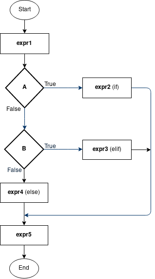

Selektion (if ... elif ... else ...)
====================================
Det er ofte nødvendigt at vælge (selektere) mellem
forskellige stykker kode som skal udføres i forskellige situationer.

Tag for eksempel følgende simple program
som tegner et polygon vha. turtle-modulet:

.. code-block:: python
    :linenos: 

    import turtle
    t = turtle.Turtle()
    
    n = int(input("How many sides would you like in your polygon?")) 

    for i in range(n):
        t.forward(100)
        t.right(360/n)

    turtle.exitonclick()

Programmet spørger brugeren hvor mange sider der skal være i polygonet,
men programmet opfører sig meningsløst hvis brugeren vælger et ``n`` 
som er mindre end 3 (et polygon kan f.eks. ikke have 1 eller -2 sider).

Vi har brug for en konstruktion som kan vælge (selektere)
mellem forskellige stykker kode baseret på værdien af ``n``.
Hvis ``n`` er mindre end 3 skal brugeren modtage en fejlmeddelse
ellers skal polygonet tegnet vha. for-loopet.
Dette gøres vha. en såkaldt ``if ... elif ... else`` konstruktion:

.. code-block:: python
    :emphasize-lines: 6,8
    :linenos: 

    import turtle
    t = turtle.Turtle()
    
    n = int(input("How many sides to draw in polygon?")) 

    if n < 3:
        print("Error, the polygon should have at least 3 sides")
    else: 
        for i in range(n):
            t.forward(100)
            t.right(360/n)

            turtle.exitonclick()

Linje 6 tester om ``n`` er mindre end 3 og hvis ``n`` er mindre end 3
udføres linje 7.
Hvis testen i linje 6 afgører at ``n`` ikke er mindre end 3
så udføres koden som står under under linje 8 (linje 9-13).
``n < 3`` fra linje 6 kaldes en **sammenligning** 
eller et **boolsk udtryk**.

Generelt har ``if ... elif ... else`` konstruktioner følgende udseende:

.. code-block:: python
    :emphasize-lines: 3,5,7
    :linenos: 

    expr1

    if A:
        expr2
    elif B:
        expr3
    else:
        expr4

    expr5

``A`` og ``B`` i linje 3 og 5 er **boolske udtryk** 
som enten er sande (``True``) eller falske (``False``),
f.eks. ``n<3``.

``expr1``, ``expr2`` osv. er generelle python udtryk eller kommandoer,
f.eks. ``print("whatever")`` eller ``a = 2``.

Hvis ``A`` er sand udføres ``expr2``. 
Hvis ``A`` er falsk testes det om ``B`` er sand.
Hvis ``B`` er sand udføres ``expr3``.
Hvis ``B`` også er falsk udføres ``expr4``.

``expr1`` udføres altid i starten af programmet
og ``expr5`` udføres altid til sidst.
Programmet kan beskrives vha. nedenstående flowdiagram.
Flowdiagrammet understreger hvad der lige er blevet sagt,
nemlig at kun én af ``expr1``, ``expr2`` og ``expr3`` udføres.

Et konkret eksempel på flowdiagrammet kunne være:

.. code-block:: python
   :linenos: 

   d = input("How many days in a year?")

   if d == "365":
       print("Correct!")
   elif d == "366":
       print("Correct, for a leap year!")
   else:
       print("Wrong ...")

   print("Thanks for playing.")

.. admonition:: Opgave
    
    Hvilke Python udtryk eller kommandoer fra ovenstående eksempler
    svarer til ``expr1``, ``expr2`` osv. fra flowdiagrammet?

Der kan være et valgfrit antal ``elif`` cases.

.. admonition:: Opgave

    Skriv et program som spørger brugeren hvor mange dage
    der er i en måned og vurderer svaret vha. ``if ... elif ... else``
    med mindst 2 ``elif``-cases.

``if ... elif ... else`` udtryk også nestes, i.e. ``expr1`` fra tidligere eksempel
kan være et andet ``if ... elif ... else`` udtryk.

.. code-block:: python
   :linenos: 

   month = input("Name a month (jan, feb, apr etc.): ")
   num_days = input("How many days in {}?".format(month))
   
   if month in ['jan', 'mar', 'may', 'jul', 'aug', 'oct', 'dec']:
       if num_days == "31":
           print("Correct!")

       else:
           print("Wrong!")

``month in ['jan', 'mar', 'may']`` fra linje 4 er endnu 
et boolsk udtryk, som afgører om tekststrengen indeholdet i variablen ``month``
findes blandt tekststrengene i listen ``['jan', 'mar', 'may']``.
Svaret på spørgsmålet er ``True`` eller ``False``.

.. admonition:: Opgave

    Udvid ovenstående eksempel således det også kan håndtere
    februar (husk februar kan have 29 dage).

    Udvid det yderligere så det kan håndtere månederne med 30 dage.

De to nestede ``if``-udtryk fra eksemplet med måneder og deres dage
kan omskrives til et enkelt ``if ... else``-udtryk 
med de to betingelser (at måneden findes i en liste og at antal dage er 31)
kombineret til en enkelt betingelse:

.. code-block:: python
   :linenos: 

   month = input("Name a month (jan, feb, apr etc.): ")
   num_days = input("How many days in {}?".format(month))
   
   if month in ['jan', 'mar', 'may', 'jul', 'aug', 'oct', 'dec'] and num_days == "31":
       print("Correct!")
   else:
       print("Wrong!")

``and`` i linje 4 er en såkaldt **boolsk operator** eller **logisk operator**.
Den bruges til at sammensætte to boolske udtryk
og giver svaret ``True`` hvis de to boolske udtryk 
(``month in ['jan'`` og ``num_days == "31"``)
begge er sande, ellers giver den ``False``.

Der findes en tilsvarende boolsk operator ``or``
som også sammensætter to boolske udtryk,
men den svarer ``True`` hvis blot ét af de to boolske udtryk er sande.
``or`` giver kun ``False`` hvis begge boolske udtryk er falske.

.. admonition:: Opgave

   Modificer din forrige opgave, eller udvid ovenstående eksempel,
   således du benytter ``and`` ved månederne med 30 dage
   og ``or`` i forbindelse med specialtilfældet februar.

Sammenligninger og andre boolske udtryk
---------------------------------------
``a == b`` bruges til at tjekke om værdien af ``a`` og ``b`` er ens.

``a != b`` bruges til at tjekke om værdien af ``a`` og ``b`` er forskellig.

``a > b`` bruges til at tjekke om værdien af ``a`` er større end værdien af ``b``.

``a >= b`` bruges til at tjekke om værdien af ``a`` er større end eller lig med værdien af ``b``.

``a < b`` bruges til at tjekke om værdien af ``a`` er mindre end værdien af ``b``.

``a <= b`` bruges til at tjekke om værdien af ``a`` er mindre end eller lig med værdien af ``b``.

``a in [b,c,d,e]`` bruges til at afgøre om værdien af ``a`` findes blandt
værdierne i listen.

``"ab" in "abcdef"`` bruges til at afgøre om tekstrengen ``"ab"`` 
findes i tekststrengen ``"abcdef"``.

.. admonition:: Opgave

    Afgør manuelt om følgende udsagn er sande eller falske,
    og test det efterfølgende (måske et ad gangen)
    i en python-fil ala:

    .. code-block:: python
        :linenos:

        #print(2 == 2)
        print(2 > 3)

    ``3 < 2``

    ``3 != 2``

    ``5 == 5``

    ``"what" == "ever"``

    ``"abc" == "abc"``

    ``2*3-2 == 4``

    ``int(2.7) == 2``

    ``min([1,2,3]) > 0``

    ``4>=4``

    ``4 in [3,6,1,8]``

    ``"ab" in ["aa", "ab", "ac", "ad"]``

    ``"name" in "Hello, my name is Alice"``

    ``"alice" in "Hello, my name is Alice"``

    ``5 > 2 and 8 > 5``

    ``7 > 2 and 7 > 7``

    ``2 == 3 or 2>0``

    ``"lol" == "LOL" or "lol" == "lol"``

.. admonition:: Opgave 

    .. code-block:: python
        :linenos:

        n = int(input("Write a number between 1 and 100:"))

    Udvid programmet således det viser brugeren en fejl
    hvis brugeren indtaster et tal som ikke ligger mellem 0 og 100.

    Lav en løsning som bruger nestede``if ... else``-udtryk og
    en anden løsning som bruger ``and``.

    Hvis du har brugt ``<=`` og ``>=`` så lav din løsning om
    således den bruger ``<`` og ``>`` i stedet for, og vice versa.

.. admonition:: Opgave 

    .. code-block:: python
        :linenos:

        import random

        num = random.randint(1,10)
        print("I've picked a number between 1 and 10, "
              "guess what it is!")
        
        while True:
            guess = int(input("Guess: "))

            if guess == num:
                print("Yeah, you win!")
                break

    Udvid ovenstående program således det giver brugeren/spilleren
    et hint til om han/hun skal gætte højere eller lavere.
